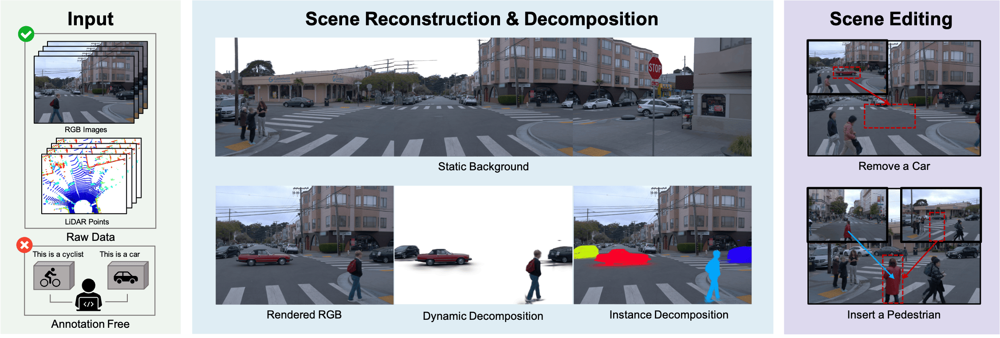

# UnIRe: Unsupervised Instance Decomposition for Dynamic Urban Scene Reconstruction

<p align="center">
  <a href="https://arxiv.org/abs/2504.00763"></a>
  <a href="https://yunxuanmao.github.io/unire_website/"></a>
</p>

> **UnIRe: Unsupervised Instance Decomposition for Dynamic Urban Scene Reconstruction**
>
> ICRA 2026

<p align="center">
  
</p>

## Abstract

Reconstructing and decomposing dynamic urban scenes is crucial for autonomous driving, urban planning, and scene editing. However, existing methods fail to perform instance-aware decomposition without manual annotations, which is critical for instance-level scene editing. We propose **UnIRe**, a 3D Gaussian Splatting (3DGS) based approach that decomposes a scene into a static background and individual dynamic instances using only RGB images and LiDAR point clouds. At its core, we introduce **4D superpoints**, a novel representation that clusters multi-frame LiDAR points in 4D space, enabling unsupervised instance separation based on spatiotemporal correlations. These 4D superpoints serve as the foundation for our decomposed 4D initialization, providing spatial and temporal initialization to train a dynamic 3DGS for arbitrary dynamic classes without requiring bounding boxes or object templates. Furthermore, we introduce a smoothness regularization strategy in both 2D and 3D space, further improving the temporal stability.

## Overview

UnIRe consists of two core stages:

1. **4D SuperPoint-Based Initialization**: Clusters multi-frame LiDAR points via self-supervised scene flow estimation, generates temporally consistent 4D superpoints, and performs spatiotemporal clustering to decompose the scene into static background and individual dynamic instances.

2. **Dynamic Scene Reconstruction**: Uses the decomposed initialization to train a 3DGS model with a static layer (vanilla Gaussians) and a dynamic layer (per-point deformation in canonical space), supervised by ground truth images and projected LiDAR depth maps.


## Installation

### Prerequisites
- Python 3.9
- CUDA-compatible GPU
- Conda (recommended)

### Setup

```bash
# Clone the repository with submodules
git clone --recursive https://github.com/<your-username>/UnIRe.git
cd UnIRe

# Create conda environment
conda create -n unire python=3.9 -y
conda activate unire

# Install PyTorch (adjust CUDA version as needed)
pip install torch==2.0.0 torchvision==0.15.0 --index-url https://download.pytorch.org/whl/cu118

# Install dependencies
pip install -r requirements.txt
pip install git+https://github.com/nerfstudio-project/gsplat.git@v1.3.0
pip install git+https://github.com/facebookresearch/pytorch3d.git
pip install git+https://github.com/NVlabs/nvdiffrast

# Install third-party packages
cd third_party/smplx && pip install -e . && cd ../..
```

## Data Preparation

We support [Waymo Open Dataset](https://waymo.com/open/) and [KITTI](http://www.cvlibs.net/datasets/kitti/). See the dataset-specific instructions:

- Waymo: [docs/Waymo.md](docs/Waymo.md)
- KITTI: [docs/KITTI.md](docs/KITTI.md)

Other datasets (NuScenes, NuPlan, ArgoVerse, PandaSet) are also supported via the unified data system inherited from DriveStudio:

- NuScenes: [docs/NuScenes.md](docs/NuScenes.md)
- NuPlan: [docs/Nuplan.md](docs/Nuplan.md)
- ArgoVerse: [docs/ArgoVerse.md](docs/ArgoVerse.md)
- PandaSet: [docs/Pandaset.md](docs/Pandaset.md)

## Usage

UnIRe follows a three-stage pipeline:

### Step 1: Scene Flow Initialization

Estimate self-supervised scene flow and perform per-frame DBSCAN clustering on LiDAR point clouds.

```bash
export PYTHONPATH=$(pwd)

python tools/init_flows.py \
    --config_file configs/init_flow.yaml \
    --output_root ./output_flow/ \
    --run_name $scene_idx \
    dataset=waymo/3cams \
    data.scene_idx=$scene_idx \
    data.start_timestep=$start_timestep \
    data.end_timestep=$end_timestep
```

### Step 2: 4D SuperPoint Clustering

Cluster 4D superpoints using spatiotemporal similarity to obtain consistent instance decomposition.

```bash
python tools/init_cluster.py \
    --flow_dir ./output_flow/$scene_idx \
    --output_dir ./output_flow/$scene_idx/cluster \
    --eps 0.5 \
    --static_trunc 0.02
```

### Step 3: Training

Train the decomposed 3DGS model with static background and dynamic instances.

```bash
python tools/train.py \
    --config_file configs/unire.yaml \
    --output_root ./output/ \
    --project unire \
    --run_name $expname \
    dataset=waymo/3cams \
    data.scene_idx=$scene_idx \
    data.start_timestep=$start_timestep \
    data.end_timestep=$end_timestep \
    model.init_flow_path=./output_flow/$scene_idx/checkpoint.pt
```

### Evaluation

```bash
python tools/eval.py --resume_from $checkpoint_path
```

### Scene Editing

UnIRe supports instance-level scene editing such as object removal, replacement, and insertion. Create an edit config YAML file (e.g., `edit_remove.yaml`) specifying the editing task:

```yaml
# Example: remove instances with IDs 0 and 3
task: remove
args:
  remove_id: [0, 3]
```

```yaml
# Example: collect instance Gaussians for later replacement
task: collect
args:
  collect_id: [2]
```

```yaml
# Example: replace instance 5 with collected instance 2
task: replace
instance_load_folder: /path/to/instance_ckpt
args:
  replace_dict:
    5: 2
```

Then run:

```bash
python tools/edit.py \
    --resume_from $checkpoint_path \
    --edit_cfg edit_remove.yaml
```

The `--edit_cfg` path is relative to the checkpoint directory.

## Key Configuration

The main config file is [`configs/unire.yaml`](configs/unire.yaml):

| Parameter | Description |
|-----------|-------------|
| `trainer.optim.num_iters` | Total training iterations (default: 30000) |
| `trainer.losses.optical_flow_smooth.w` | 2D smoothness regularization weight |
| `model.DynamicNodes.reg.flow_reg.w` | 3D smoothness regularization weight |
| `model.DynamicNodes.ctrl.coarse_train_interval` | Steps before enabling per-point deformation |
| `model.init_flow_path` | Path to the 4D superpoint initialization output |

Flow initialization config is at [`configs/init_flow.yaml`](configs/init_flow.yaml):

| Parameter | Description |
|-----------|-------------|
| `init.flow_cfg.eps` | DBSCAN epsilon for spatial clustering |
| `init.flow_cfg.min_samples` | DBSCAN minimum samples |
| `init.flow_cfg.iters` | Scene flow optimization iterations |

## Results

Quantitative results on Waymo Open Dataset and KITTI Dataset:

### Waymo Open Dataset

| Method | Type | PSNR | SSIM | LPIPS |
|--------|------|------|------|-------|
| OmniRe | Annotation-based | 34.81 | 0.956 | 0.054 |
| DeSiRe-GS | Annotation-free | 32.71 | 0.949 | 0.103 |
| **UnIRe (Ours)** | **Annotation-free** | **35.58** | **0.967** | **0.053** |

### KITTI Dataset

| Method | Type | PSNR | SSIM | LPIPS |
|--------|------|------|------|-------|
| OmniRe | Annotation-based | 28.22 | 0.916 | 0.072 |
| DeSiRe-GS | Annotation-free | 28.62 | 0.921 | 0.085 |
| **UnIRe (Ours)** | **Annotation-free** | **28.92** | **0.929** | **0.064** |

## Acknowledgments

This codebase is built upon [DriveStudio](https://github.com/ziyc/drivestudio) and [OmniRe](https://ziyc.github.io/omnire/). We thank the authors for their excellent work. We also utilize [gsplat](https://github.com/nerfstudio-project/gsplat) for Gaussian rasterization and [Let It Flow](https://arxiv.org/abs/2404.08363) for self-supervised scene flow estimation.

## Citation

```bibtex
@article{mao2025unire,
  title={Unire: Unsupervised instance decomposition for dynamic urban scene reconstruction},
  author={Mao, Yunxuan and Xiong, Rong and Wang, Yue and Liao, Yiyi},
  journal={arXiv preprint arXiv:2504.00763},
  year={2025}
}
```

## License

This project is released under the [Apache 2.0 License](LICENSE).
